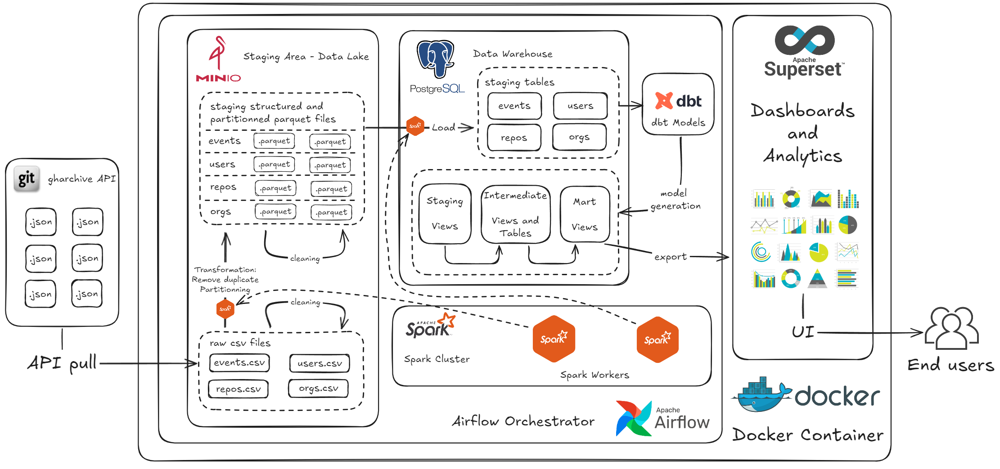
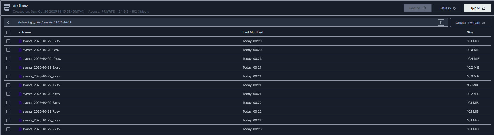
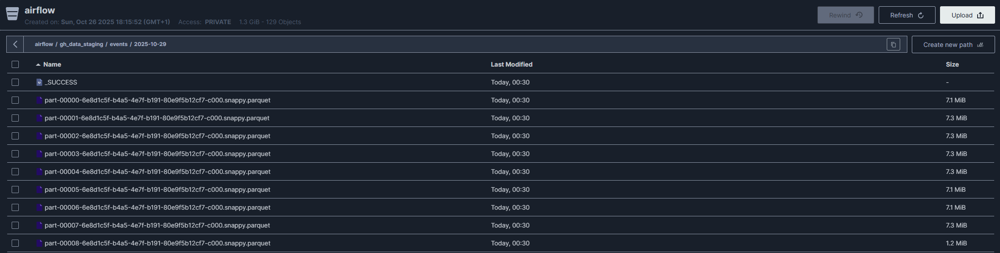
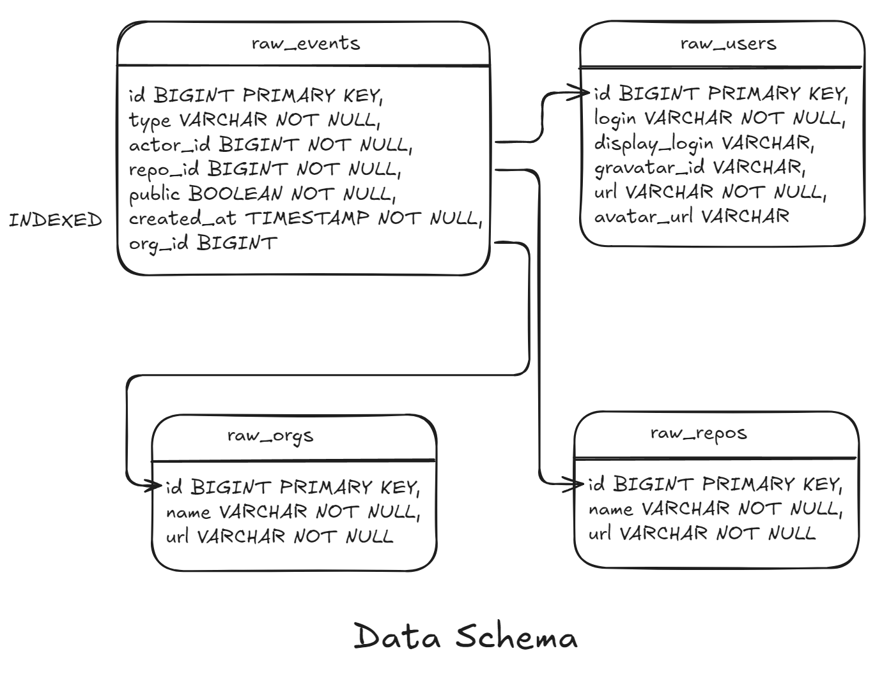
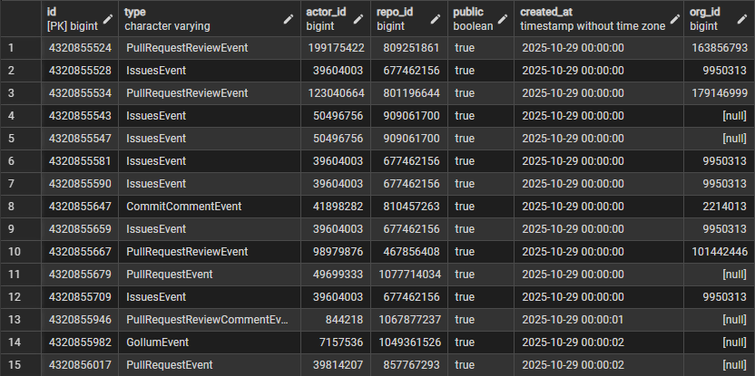
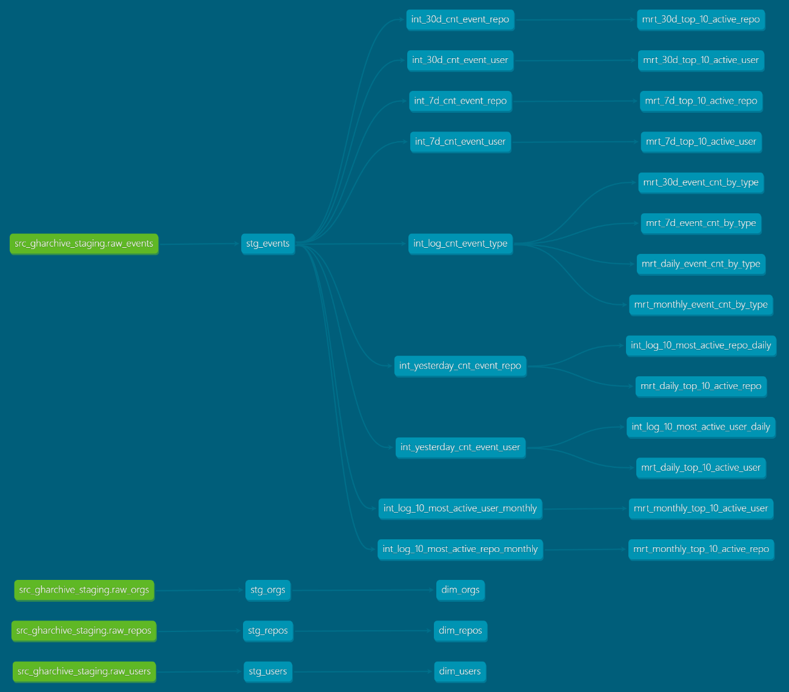
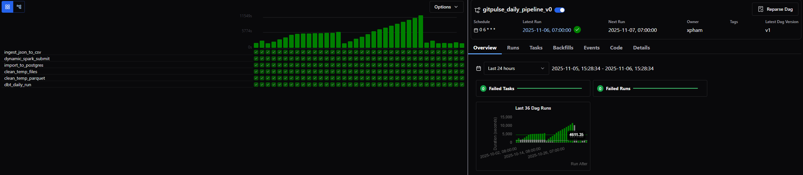
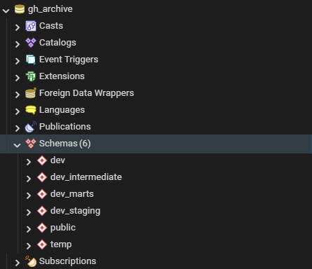
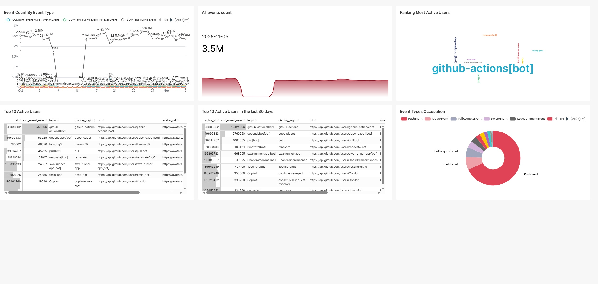

[TOC]

# Local GitPulse - A local and scalable data pipeline recording real-time Github public events

## Overview

This project implements an end to end data pipeline that **E**xtract github events data from **[GH Archive API](https://www.gharchive.org/)** and stores them to a staging area. The staging data will be **T**ransformed, restructured and then **L**oaded to a local database as my Data Warehouse solution. From that, various data models will be built for visualisation and analysis.

Every day in Github, there are over 4 milion public actions recored. The **[GH Archive API](https://www.gharchive.org/)** records the public actions. The contribution of this project is to give an insight view on this data while still demonstrating the process of data processing by workflow.

## Tech stack

The whole project is executed in **Docker containers** which contain the following components:
- Workflow orchestrator: [Apache Airflow](https://airflow.apache.org/)
- Data Warehouse: [PostgreSQL](https://www.postgresql.org/) with management tool [pgAdmin](https://www.pgadmin.org/)
- Staging area and data lake: [MinIO S3](https://www.min.io/)
- Large data processing engine: [Apache Spark](https://spark.apache.org/)
- Data Modeling: [dbt](https://www.getdbt.com/)
- Data Visualisation and Analytics: [Superset](https://superset.apache.org/)
## Data source
The data source of the project will be [GH Archive](https://www.gharchive.org/)
GH Archive is a project to **record** the public GitHub timeline, **archive it**, and **make it easily accessible** for further analysis. 

> GitHub provides [15+ event types](https://docs.github.com/en/webhooks-and-events/events/github-event-types), which range from new commits and fork events, to opening new tickets, commenting, and adding members to a project. These events are aggregated into hourly archives, which you can access with any HTTP client. Each archive contains JSON encoded events as reported by the GitHub API.

To pull the file JSON from the API:
```bash
wget https://data.gharchive.org/<year>-<month>-<day>-<hour>.json.gz
```

See [example of an event in json](#an-example-of-an-event-json)


## Architechture

The schema below demonstrates the structure of the project.


The infrastructure in the project includes:
- **Containerisation - Docker**: Manage and run containers as different components in an isolated environment. The containers used in the projects are: **Minio**, **PostgreSQL**, **Apache Airflow**, **Apache Spark**, **Apache Superset** and **PgAdmin**.

- **Workflow Orchestrator - Airflow**: Define, schedule, and monitor workflows. This tool also integrates many components by the connection and operators ( for database, storage, data processing workers, ... ) to execute in an efficient manner. In this project, Airflows handles and schedule tasks concerning MinioS3 storages, PostgreSQL database, Spark workers and dbt. 

- **Data Storage Solution - Minio S3**: Act as a data lake, it provides **object storage**, a scalable, durable, cloud-native way to store and retrieve large amounts of unstructured data. In this project, Minio S3 is used to store unstructured data pulled from the API ( under .csv files ), to store staging data ( under .parquet files, act as staging area ) before loading to the data warehouse.

- **Large data processing - Apache Spark**: designed to **process huge volumes of data**, often too large to fit on a single machine, using **distributed computing**.

- **Data warehouse Solution - PostgreSQL**: plays the role of a **relational database (RDBMS)**, and when used as a **data warehouse**, it becomes the central system where **cleaned, structured, and query-optimized data** is stored for analytics, reporting, and decision-making. PostgreSQL are used to store staging loaded data from the data lake, as well as transformed and cleaned data for analytics

- **Data Modeling - DBT**: provides data models which are responsible for **transforming raw data into clean, reliable, analytics-ready tables**. dbt contributes in this project to build views and incremental models for reporting and logging.

- **Visualization and reporting - Apache Superset:** **visualization and analytics layer** of a modern data platform. Provides UI to let users **explore, analyze, and visualize** the data stored in your data warehouse through dashboards and interactive charts.


## Workflow in details

In this project, the tasks are divided into 2 categories: Daily tasks and Monthly tasks
### Daily tasks

Daily tasks are scheduled every morning at 6 AM. Including:

#### API JSON Pull, Write as CSV

The task includes the data extract and ingestion steps :
- Pulling JSON files from GHArchive API
- Each line from JSON are then collected, restructured and written as csv temporary files.
- These temporary files will then be uploaded to minio storage. 


*Image: raw csv files in Minio Storage*

#### Spark Processing, Staging

In this tasks, the raw .csv files are processed under spark dataframes. For events, users, repos and orgs, lines with the duplicate id will be dropped. At the end, these spark dataframes will be partitionned and rewritten to Minio Storage under .parquet files



*Image: staging area in Minio Storage

#### Import to Postgres

All data in the staging area will be imported to the PostgreSQL database following this schema:



An example of events in `dev.raw_events` table:



#### Data Modeling, dbt

In this project, the data models are created base on 3 layers:

The schema below demonstrate the models



##### Layer 1: Staging

With 4 view:
- stg_events
- stg_users
- stg_repos
- stg_orgs

These staging data models are views with the direct projection of the current raw tables. 

##### Layer 2: Intermediate

This layer will devide the data in the staging area into 3 categories:
- Event aggregation by event types
- Event aggregation by users
- Event aggregation by repositories

Each categories contains models to record the live result ( under view materialisation, by day, by the last 7 days and by the last 30 days ) and logs ( under incremental materialisation, daily and monthly )

##### Layer 3: Data Mart

This layer provides views for the direct serving of visualisation tools. Here, for users and repos, we filter the top 10 most events.

#### Cleaning

After all the ingestion and import tasks are finished, data in the staging area will be removed

#### Visualisation

## Setup instructions

### Prequisites

For installing this data pipeline, you will need:
- A machine (Real, VM), ideal with Linux based OS
- Docker
- Git
And that's all !

### Setup the infrastructure

First, you need to clone the repository

```bash
git clone https://github.com/xuan-phuc-pham/GitPulse-local.git
```

For the first time, you need to build the images
```bash
docker compose up --build
```

For the following run, you just need to run the containers
```bash
docker compose up
```

We have several components, let set up first the credential for Minio

Go to the Minio page: `http://<your_host_ip>:9000`, credentials will be:
- Username : `xpham`
- Password : `xpham_minio`
Of course you can modify it on `docker-compose.yaml`

Go on Access Keys, you will need to create 2 access keys:
- One for Spark access: With access key `testuser` and secret key `password`
- One default key for Airflow access, with the default given access key and secret key. This default key will be downloaded and paste on the file `setup_airflow.sh`.

```
docker compose exec af bash -c "airflow connections add minio_conn \
--conn-type aws \
--conn-extra '{\"aws_access_key_id\": \"<your access key goes here>\", \"aws_secret_access_key\": \"your secret key goes here\", \"endpoint_url\": \"http://minio:9000\"}'"
```

Once the images are built and the containers are run, you need to make sure that Airflow is initialised (by looking at the log). Then execute the setup for airflow

```bash
sudo bash setup_airflow
```

Now the infrastructure is initialised

### Down

Using this command:
```bash
sudo bash docker_compose_down.sh
```

Is a proper way to shutdown the system such that for the next run, there will not be errors (concerning to the connection)

## Example outputs

The current pipeline progress demonstration. The pipeline is still running until now from the 1 October, 2025




Overview of data in Postgres



Overview of the data visualisation demonstration




## Future improvements

- Run a monthly pipeline 
  - For removing residual fact data
  - For creating a monthly data models which reports statistic each month


## Contact

PHAM Xuan Phuc, Engineering Student in Security and Information Technology at INSA Centre Val de Loire, France.

[LinkedIn](https://www.linkedin.com/in/xphuc-pham/)

Email: xuanphuc280203@gmail.com

## Annex

### An example of an event JSON

An example of an event ( among milions of events per hour )

```json
{
  "id": "2489651194",
  "type": "IssueCommentEvent",
  "actor": {
    "id": 7356386,
    "login": "Poulern",
    "gravatar_id": "",
    "url": "https://api.github.com/users/Poulern",
    "avatar_url": "https://avatars.githubusercontent.com/u/7356386?"
  },
  "repo": {
    "id": 27872927,
    "name": "cptnnick/F3_PA",
    "url": "https://api.github.com/repos/cptnnick/F3_PA"
  },
  "payload": {
    "action": "created",
    "issue": {
      "url": "https://api.github.com/repos/cptnnick/F3_PA/issues/1",
      "labels_url": "https://api.github.com/repos/cptnnick/F3_PA/issues/1/labels{/name}",
      "comments_url": "https://api.github.com/repos/cptnnick/F3_PA/issues/1/comments",
      "events_url": "https://api.github.com/repos/cptnnick/F3_PA/issues/1/events",
      "html_url": "https://github.com/cptnnick/F3_PA/issues/1",
      "id": 52843291,
      "number": 1,
      "title": "Fix line 26 in briefing.sqf",
      "user": {
        "login": "Poulern",
        "id": 7356386,
        "avatar_url": "https://avatars.githubusercontent.com/u/7356386?v=3",
        "gravatar_id": "",
        "url": "https://api.github.com/users/Poulern",
        "html_url": "https://github.com/Poulern",
        "followers_url": "https://api.github.com/users/Poulern/followers",
        "following_url": "https://api.github.com/users/Poulern/following{/other_user}",
        "gists_url": "https://api.github.com/users/Poulern/gists{/gist_id}",
        "starred_url": "https://api.github.com/users/Poulern/starred{/owner}{/repo}",
        "subscriptions_url": "https://api.github.com/users/Poulern/subscriptions",
        "organizations_url": "https://api.github.com/users/Poulern/orgs",
        "repos_url": "https://api.github.com/users/Poulern/repos",
        "events_url": "https://api.github.com/users/Poulern/events{/privacy}",
        "received_events_url": "https://api.github.com/users/Poulern/received_events",
        "type": "User",
        "site_admin": false
      },
      "labels": [
        {
          "url": "https://api.github.com/repos/cptnnick/F3_PA/labels/bug",
          "name": "bug",
          "color": "fc2929"
        }
      ],
      "state": "open",
      "locked": false,
      "assignee": {
        "login": "cptnnick",
        "id": 6839081,
        "avatar_url": "https://avatars.githubusercontent.com/u/6839081?v=3",
        "gravatar_id": "",
        "url": "https://api.github.com/users/cptnnick",
        "html_url": "https://github.com/cptnnick",
        "followers_url": "https://api.github.com/users/cptnnick/followers",
        "following_url": "https://api.github.com/users/cptnnick/following{/other_user}",
        "gists_url": "https://api.github.com/users/cptnnick/gists{/gist_id}",
        "starred_url": "https://api.github.com/users/cptnnick/starred{/owner}{/repo}",
        "subscriptions_url": "https://api.github.com/users/cptnnick/subscriptions",
        "organizations_url": "https://api.github.com/users/cptnnick/orgs",
        "repos_url": "https://api.github.com/users/cptnnick/repos",
        "events_url": "https://api.github.com/users/cptnnick/events{/privacy}",
        "received_events_url": "https://api.github.com/users/cptnnick/received_events",
        "type": "User",
        "site_admin": false
      },
      "milestone": null,
      "comments": 2,
      "created_at": "2014-12-25T02:00:16Z",
      "updated_at": "2015-01-01T15:00:14Z",
      "closed_at": null,
      "body": "[02:48:59] Poulern: http://puu.sh/dIqRL/1d8422a923.png\r\n[02:55:08] Poulern: but i get this erorr\r\n[02:55:13] Poulern: every tiem\r\n[02:55:28] Nick van der Lee: I wanted it designated by side instead of faction\r\n[02:56:02] Nick van der Lee: OH\r\n[02:56:15] Nick van der Lee: Try (str(side player) )\r\n[02:56:45] Poulern: _unitSide = toLower (side player);\r\n[02:56:51] Poulern: _unitSide = (str(side player) )\r\n[02:56:53] Poulern: ?\r\n[02:56:55] Poulern: like so\r\n[02:57:12] Nick van der Lee: _unitSide = toLower (str(side player))\r\n[02:58:03] Poulern: if (_unitSide != toLower (faction (leader group player))) then {_unitSide = toLower (faction (leader group player))};\r\n[02:58:06] Poulern: error missing ;\r\n[02:58:21] Nick van der Lee: Delete that part\r\n[02:58:26] Nick van der Lee: It's obsolete\r\n[02:58:38] Poulern: Make sure to fix the main\r\n[02:58:46] Nick van der Lee: Make a ticket\r\n[02:58:48] Poulern: briefing.sqf in the F3_PA\r\n[02:58:51] Poulern: okay man\r\n[02:58:55] Nick van der Lee: I'll need to fix in main F3 too\r\n[02:59:11] Nick van der Lee: It's 3 AM I ain't gonna remember : P"
    },
    "comment": {
      "url": "https://api.github.com/repos/cptnnick/F3_PA/issues/comments/68488497",
      "html_url": "https://github.com/cptnnick/F3_PA/issues/1#issuecomment-68488497",
      "issue_url": "https://api.github.com/repos/cptnnick/F3_PA/issues/1",
      "id": 68488497,
      "user": {
        "login": "Poulern",
        "id": 7356386,
        "avatar_url": "https://avatars.githubusercontent.com/u/7356386?v=3",
        "gravatar_id": "",
        "url": "https://api.github.com/users/Poulern",
        "html_url": "https://github.com/Poulern",
        "followers_url": "https://api.github.com/users/Poulern/followers",
        "following_url": "https://api.github.com/users/Poulern/following{/other_user}",
        "gists_url": "https://api.github.com/users/Poulern/gists{/gist_id}",
        "starred_url": "https://api.github.com/users/Poulern/starred{/owner}{/repo}",
        "subscriptions_url": "https://api.github.com/users/Poulern/subscriptions",
        "organizations_url": "https://api.github.com/users/Poulern/orgs",
        "repos_url": "https://api.github.com/users/Poulern/repos",
        "events_url": "https://api.github.com/users/Poulern/events{/privacy}",
        "received_events_url": "https://api.github.com/users/Poulern/received_events",
        "type": "User",
        "site_admin": false
      },
      "created_at": "2015-01-01T15:00:14Z",
      "updated_at": "2015-01-01T15:00:14Z",
      "body": "Sorry yes this has been fixed. GJ"
    }
  },
  "public": true,
  "created_at": "2015-01-01T15:00:14Z"
}
```


